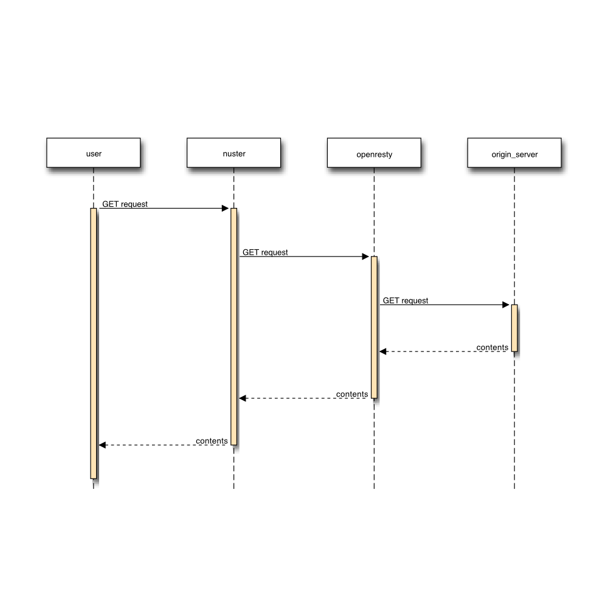
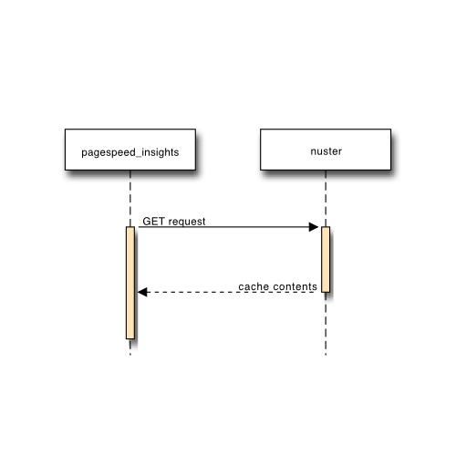
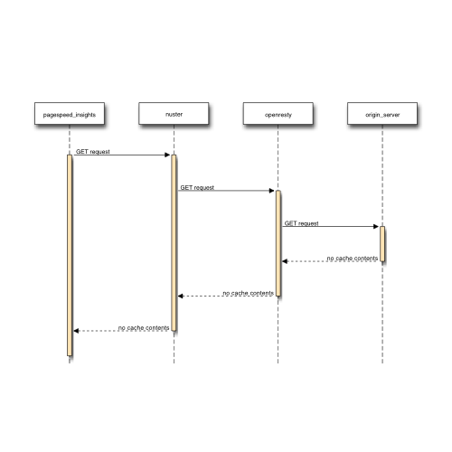
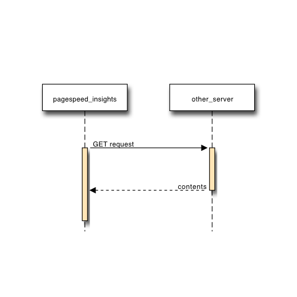

web_performance_insights
===

WEBコンテンツの検証用リポジトリ

## 概要

 - 測定は、「[pagespeed insights](https://developers.google.com/speed/pagespeed/insights/?hl=ja)」で行い、WEBコンテンツパフォーマンスを測定し検証するための環境。
    - 「[ngrok](https://ngrok.com/)」を使い、ローカル環境をインターネット上に公開することで測定可能
    - 内部の向け先を書き換える必要があるため、「対象FQDN」を「ngrokで発行されたFQDN」にopenrestyを使って動的に書き換える
 
## 構成

### シーケンス図

#### ファーストキャッシュ時

 - 事前にキャッシュサーバにキャッシュさせる必要があるため

#### 測定時

 - 対象FQDNのtopページにrequestで、各々の紐づくrequestの流れのシーケンス図

##### 対象FQDNキャッシュコンテンツ

##### 対象FQDN未キャッシュコンテンツ

##### 対象外FQDNコンテンツ

## 各README.md

 - [Openrestyについて](openresty/README.md)
 - [シーケンス図について](sequence_tools/README.md)

