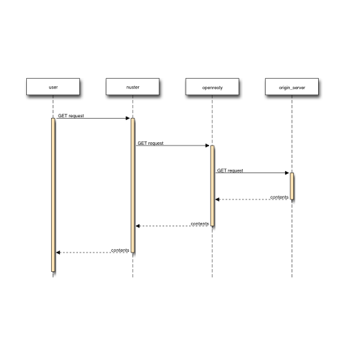

web_performance_insights
===

WEBコンテンツの検証用リポジトリ

## 概要

 - 測定は、「[pagespeed insights](https://developers.google.com/speed/pagespeed/insights/?hl=ja)」で行い、WEBコンテンツパフォーマンスを測定し検証するための環境。

## 構成

### シーケンス図

#### ファーストキャッシュ時

 - 事前にキャッシュサーバにキャッシュさせる必要があるため

#### 測定時

 - 対象FQDNのtopページにrequestで、各々の紐づくrequestの流れのシーケンス図

##### 対象FQDNキャッシュコンテンツ

##### 対象FQDN未キャッシュコンテンツ

##### 対象外FQDNコンテンツ

## 各README.md

 - [シーケンス図について](sequence_tools/nwdiag.md)
